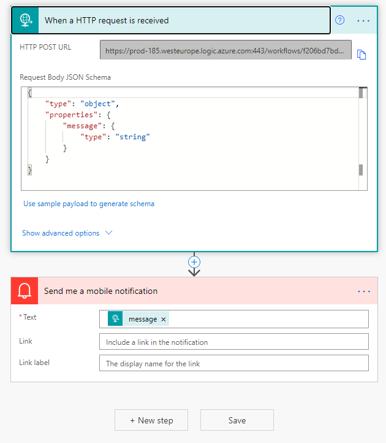

# Raspberry-Pi-Wired-Door-Bell

This is a simple wired door bell setup that sends a notification to your phone when it's pressed. 
Note: you need access to a non-free Microsoft account with Power Automate. 
You can pay for this yourself or most business accounts have it, i'm using my work account. 

My Setup: 
Raspberry Pi Zero W 
Raspberry Pi OS 
Standard Wired Door Bell (was £2.50 on amazon) 
2 wires (i used 2 out of an old ethernet cable) 

1. Strip the ends of the wires so there's about 1cm of bare copper showing 
2. Attach the the two cables to each of the two contacts on the bell 

4. Connect the other ends to the 3rd and 6th outside contacts on the Pi (you can use the same contacts no matter what Pi you're using) 

6. Install Raspberry Pi OS Lite on a SD card, insert into your Pi and turn on 
7. Setup your Pi by configuring WiFi, Hostname, Password and SSH 
8. Install updates, python, python.rpi.gpio and python.requests 
    *sudo apt update
    sudo apt upgrade
    sudo apt-get install python python.rpi.gpio python.requests
    sudo reboot* 
7. Add the bell.py file to the root of your pi 
8. Open Power Automate and sign in 
9. Click Create, Automated Flow then skip 
10. Add the trigger as "When a HTTP Request is received" and set the following as the body schema 
    *{
        "type": "object",
        "properties": {
            "message": {
                    "type": "string"
                }
            }
    }* 
11. Then add a new step called send me a mobile notification and set the text as the message tag from the previous step 
12. Save the flow then copy the HTTP POST URL from the first step 

14. Enter the URL in the URL variable in the bell.py file 
15. Run the bell.py, press the bell and see if you get a notification 
Ensure you have the Power Automate app installed on your phone and signed in with the same account 
    *python bell.py* 
15. If its working, set the file to start on bootup 
    *sudo nano /etc/rc.local* 
    Add the following just before the exit 0 
    *sudo python /bell.py &* 
16. Reboot the pi and press the button after it boots up 
